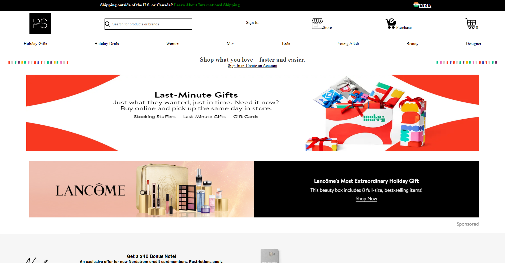

# PoshStrom - Nordstrom Clone
Nordstrom is an international Online Shopping Store. Founded in 1901 by John W. Nordstrom and Carl F. Wallin, it originated as a shoe store and evolved into a full-line retailer with departments for clothing, footwear, handbags, jewelry, accessories, cosmetics, and fragrances. As of 2021, Nordstrom operates 100 stores in 32 U.S. states, and three Canadian provinces since entering the market in 2014. One location in Puerto Rico was in operation from 2015 through 2020. We have tried to build the perfect clone of the website.

# Team Members
 - [@Ankit Kumar](https://github.com/iamankit014)
 - [@Animesh Kalita](https://github.com/Ak-nut-47)
 - [@Vishal Girhepunje](https://github.com/vishal-girhepunje)
 - [@Krishna Chhabra](https://github.com/Krishna-7777)
 - [@Subham Burnwal](https://github.com/Subham-0922)

#Build With
- HTML5
- CSS3
- JavaScript
- Node.js
- JSON Server

#Core Functionalities
- Login/Signup
- Admin:Add,Update and Delete Items.
- Product Page
- Filter and sorting
- Add to cart
- Checkout
- Payment

# Landing Page

